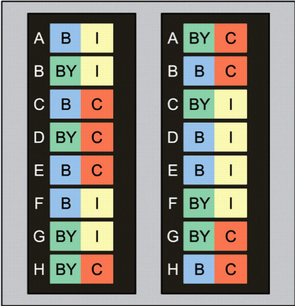
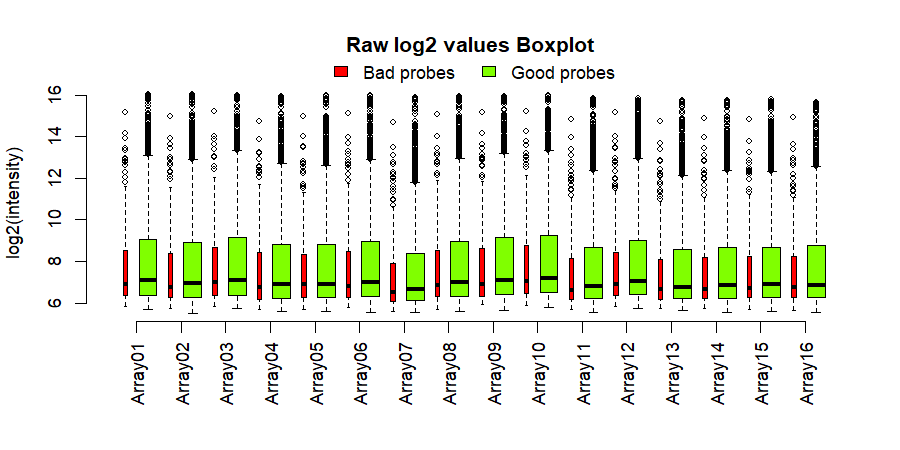
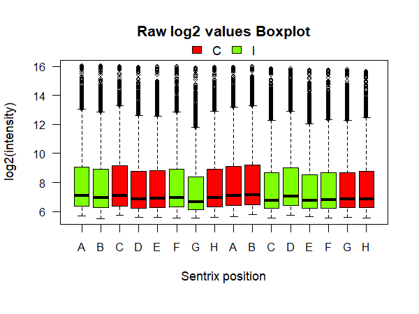
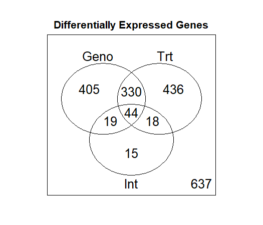
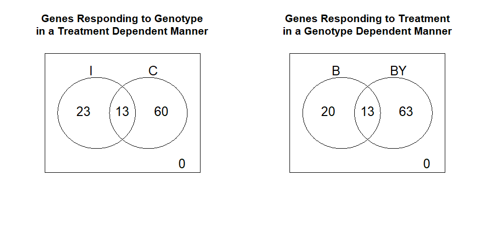
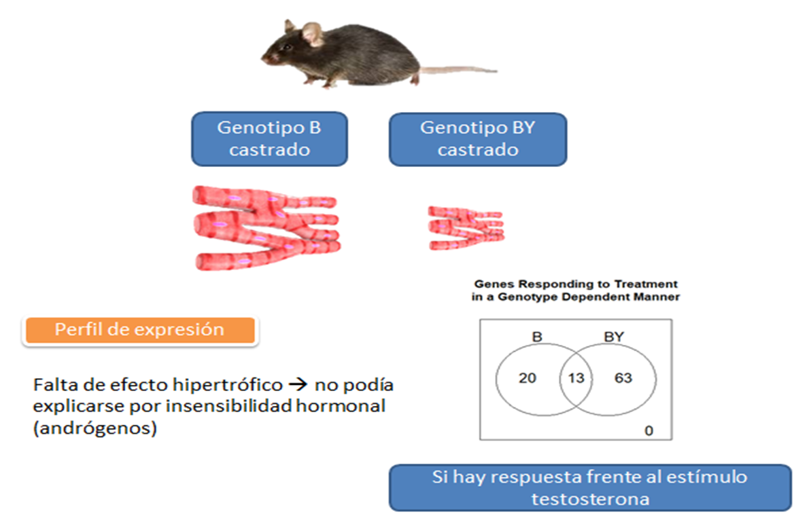

# Informe módulo 2.- 

Joel Herrera Soto.- 
Estudiante 1 año de Magister en Genética
Profesor: Ricardo Verdugo
Curso Tópicos de investigación Computacional en Genética y Genómica.
Santiago, 16.12.2019

---------------------------------------------
# Introducción

El concepto de expresión diferencial hace alusión al cambio en la expresión de genes que es explicado por, ya sea, factores ambientales-experimentales o genéticos, o dada la interación de ambos factores, o sea cuando hay expresión diferencial, es que hubo interacción genético ambiental (figura 1), permitiendo entender la variación fenotípica que pueda tener el modelo de estudio. Gracias a las aplicaciones bioinformáticas, es que podemos estudiar los cambios de expresión, permitiéndonos clasificar los genes en vías de señalización particulares y por lo tanto entregarnos un panorama de los proocesos que se vean alterados bajo los distintos escenarios experimentales a los que estén inmersos nuestro modelo de estudio.


**Figura 1**. Esquema representativo de expresión diferencial.

Para este módulo se ha realizado el tutorial de **[Expresión Diferencial](https://github.com/AliciaMstt/BioinfinvRepro/blob/master/Unidad7/Tutorial_de_expresion_diferencial_en_R.md)** del Módulo 7 el cual tenía por objetivo introducir técnicas de el análisis de datos de microarreglos para detectar genes diferencialmente expresados producto de factores experimentales o de sus interacciones. Se generaron figuras para describir control de calidad de las sondas y para describir el análsis de expresión diferencial mismo. El análisis ha sido ejecutado en el servidor remoto de la universidad bajo el lenguaje de programación UNIX y R.  

----------------------------------------------------
# Desarrollo

En el estudio se perfilaron ocho ratones machos adultos de dos cepas, C57BL/6J y C57BL/6J-chrY<A/J/NaJ> , denominadas B y BY respectivamente. De cada cepa (genotipo), cuatro animales fueron castrados (C) y cuatro animales quedaron intactos (I) a modo control. El ARN se hibridizó a BeadChips Illumina MouseRef-8 v2.0 que contienen ocho microarreglos con 25,697 sondas cada uno. Sólo se seleccionaron arbitrariamente 5000 sondas para este tutorial.



**Figura 2**. Diseño experimental de las hibridaciones de muestras por chip y dentro de chip. Los colores representan el genotipo (azul = C57BL/6J (B); verde = C57BL/6J-chrY<A/J/NaJ> (BY) y tratamiento de castración (amarillo = intacto (I); rojo = castrado (C)).

Objetivos del análisis de datos:

- Determinar si existe expresión diferencial entre genotipos.
- Determinar si existe expresión diferencial entre tratamientos.
- Evaluar las diferencias en la respuesta al tratamiento entre los dos genotipos (o sea si es que existe interacción)

## Lectura de datos en bruto

En la lectura de los datos en bruto (no normalizados) se observa que no todas las sondas muestran la misma calidad al ser alineadas con el genoma de referencia utilizado.

```
annot <- read.delim("MouseRef-8_annot.txt") #se creó un objeto que contiene el genoma de referencia.
table(annot$ProbeQuality)
```

        Bad        Good    Good****    No match     Perfect  Perfect*** Perfect**** 
        289          60          15           5        4468          53         110 

Por lo tanto se agruparon las sondas "Bad" con "No match" y lo demás como "Good probes". Son malas sondas porque hace match con secuencias repetidas, regiones intergénicas o intrónicas, o es poco problable que entregue una señal sensiblle y específica para cualquier trancrito al ser alineados contra el genoma de referencia (Barbosa-Morais et al. 2010). 

```probe_qc <- ifelse(annot$ProbeQuality %in% c("Bad", "No match"), "Bad probes","Good probes")```

## Control de calidad

Se crearon gráficos de caja coloreados por calidad de la sonda y calidad por tratamiento. 



**Figura 3**. Diagramas de caja de datos sin procesar en escala log por microarreglo y calidad de sonda. 

En la figura 3 tenemos en el eje X las sondas divididas por calidad para cada array, en donde las de mala calidad tienen menor intensidad (rojo).



**FIgura 4**. Diagramas de caja de datos en bruto por microarreglo.

En la figura 4 tenemos en el eje X, la posición de las matrices Illumina desde la A a H, mientras que en el eje Y el logaritmo en base 2 de la intensidad.  Las cajas están coloreadas según tratamiento. Se puede observar que hay una leve tendencia a mayores valores de intensidad en posiciones de castrados.

## Pruebas de expresión diferencial

Dado que el estudio utilizó un diseño factorial, es posible hacer varias preguntas a partir de los datos y ser puestas a prueba mediante una matriz de contrastes entre grupos experimentales, permitiendo evaluar si esas compraciones explican una proporción significativa de la varianza en los datos de expresión.

Los contrastes son vectores de coeficientes que cuando se multiplican con un vector de promedios por grupo experimental, crean contrastes que pueden evaluarse estadísticamente.

Se probó cada contraste utilizando 200 permutaciones, aplicando pruebas de F, utilizando una estimación de varianza residual por sonda (F1) y una estimación basada en contracción de varianza residual que utiliza información de múltiples sondas (Fs). Es importante destacar que se recomiendan al menos 1000 permutaciones.

```
test.cmat <- matest(madata, fit.fix, term="Group", Contrast=cmat, n.perm=200, 
+                     test.type = "ttest", shuffle.method="sample", verbose=TRUE)
Doing F-test on observed data ...
Doing permutation. This may take a long time ... 
Finish permutation #  100 
Finish permutation #  200 

```
La función `matest` del paquete R/MAanova puede utilizar una matriz de contrastes y evaluar si esas comparaciones explican una proporción significativa de la varianza en los datos de expresión. 
El objeto de clase `madata` incluye las sondas que sólo detectaron transcritos (contiene la matriz de datos y la tabla de diseño experimental) las cuales son 4706. El objeto de clase `fitmaanova` llamado fit.fix contiene el modelo ajustado a ANOVA. El argumento `contrast` define la matriz de contraste a ser utilizada. El argumento `verbose`muestra mensajes del progreso de cálculo. 

## Contar genes expresados diferencialmente.

En este experimento se buscaba resolver las preguntas ¿existe un efecto de interacción entre el genotipo y el tratamiento sobre la expresión génica en los cardiomiocitos? además de evaluar la naturaleza de la interacción. ¿Ambos genotipos responden al tratamiento pero en direcciones opuestas? ¿O el tratamiento tiene un efecto en uno de los genotipos y no en el otro? 

Hay que tener en cuenta que cada sonda está detectando diferentes señales biológicas, por lo que se cuenta un gen como "seleccionado" si se selecciona alguno de los transcritos (sondas). Esto se logra con la base de datos de transcritos de referencia [RefSeq](http://www.ncbi.nlm.nih.gov/RefSeq/), la cual es curada, para genes conocidos y se diseño para evitar la redundancia.

Utilizamos la librería limma para crear diagramas de Venn. Luego contaremos los genes para cada combinación de efectos marginales y de interacción.

```
> library(limma)
> Counts.DE <- vennCounts(Genes.DE)
> print(Counts.DE)
  FDR.Geno FDR.Trt FDR.Int Counts
1        0       0       0    672
2        0       0       1     29
3        0       1       0    404
4        0       1       1     25
5        1       0       0    388
6        1       0       1     41
7        1       1       0    288
8        1       1       1     57
attr(,"class")
[1] "VennCounts"
```
Contar los genes DE entre niveles de un factor condicional en el otro factor.

```
> Counts.Int_Geno <- vennCounts(Genes.Int_Geno)
> print(Counts.Int_Geno)
  FDR.Geno_I FDR.Geno_C Counts
1          0          0      3
2          0          1    100
3          1          0     35
4          1          1     14
attr(,"class")
[1] "VennCounts"
> 
> Counts.Int_Trt  <- vennCounts(Genes.Int_Trt) 
> print(Counts.Int_Trt)
  FDR.Trt_B FDR.Trt_BY Counts
1         0          0      0
2         0          1    103
3         1          0     31
4         1          1     18
attr(,"class")
[1] "VennCounts"

```
En la figura 5 se puede observar que hubo expresión diferencial de genes en las células del tejido cardiaco de los ratones de genotipos B y BY, y los ratones castrados y sin castrar. En donde la interacción describió un perfil de 96 genes expresados diferencialmente.  



**Figura 5**. Genes Diferencialemente expresados (DE) por efectos marginales y de interacción.

Ahora si revisamos los genes DE por efectos de interacción, divididos por tratamiento y genotipo (Fig. 6), se observa que hay una mayor cantidad de genes (60) que responden a la castración independientemente el genotipo del ratón. Mientras que una mayor cantidad de genes que se expresan diferencialmente (63) en el genotipo BY, en respuesta al tratamiento. 

Estos perfiles tienen una tendencia similar a las reportadas por Lamas et al. (2009),  destacando igualmente que este análisis fue una muestra de 5000 sondas utilizadas por microarreglo y un FDR de 0.2.  



**Figura 6**. Genes DE por efectos de interacción, divididos por tratamiento (izquierda) y genotipo (derecha).

# Pruebas funcionales

Ahora bien, sabiendo que existe una interacción Genotipo x Tratamiento, podemos preguntarnos si existen procesos biológicos relacionados en los genes seleccionados por interacción, realizando un análsis de enriquecimiento GO (Gene ontology).

Probaremos si existe enriquecimiento de términos GO utilizando una prueba exacta de Fisher. Se usaron dos algoritmos, la prueba clásica de término por término y el algoritmo " elim " , que tiene en cuenta la jerarquía de los términos GO para evitar la redundancia. 

```
> resultFisher.classic <- runTest(GOdata, algorithm = "classic", statistic = "fisher")
> resultFisher.elim    <- runTest(GOdata, algorithm = "elim", statistic = "fisher")

> GO_BP_Table <- GenTable(GOdata, Fisher.classic=resultFisher.classic, Fisher.elim=resultFisher.elim, 
+                         orderBy = "Fisher.elim", ranksOf = "Fisher.classic",
+                         topNodes = 20)
> 
> print(GO_BP_Table)
        GO.ID                                        Term Annotated Significant
1  GO:0007519          skeletal muscle tissue development        12           5
2  GO:0051186                  cofactor metabolic process        55          11
3  GO:0042180           cellular ketone metabolic process        20           6
4  GO:0022008                                neurogenesis        99          16
5  GO:0070555                   response to interleukin-1         5           3
6  GO:0007623                            circadian rhythm        10           4
7  GO:0043502             regulation of muscle adaptation        10           4
8  GO:0042325               regulation of phosphorylation        95          15
9  GO:0000122 negative regulation of transcription by ...        45           9
10 GO:0030968 endoplasmic reticulum unfolded protein r...         6           3
11 GO:0043525 positive regulation of neuron apoptotic ...         6           3
12 GO:0050920                    regulation of chemotaxis         6           3
13 GO:0070059 intrinsic apoptotic signaling pathway in...         6           3
14 GO:0031401 positive regulation of protein modificat...        80          13
15 GO:0030855             epithelial cell differentiation        31           7
16 GO:0048699                       generation of neurons        92          14
17 GO:0001974                     blood vessel remodeling         7           3
18 GO:0006890 retrograde vesicle-mediated transport, G...         7           3
19 GO:0010324                       membrane invagination         7           3
20 GO:0042752              regulation of circadian rhythm         7           3
   Expected Rank in Fisher.classic Fisher.classic Fisher.elim
1      0.95                      2         0.0014      0.0014
2      4.35                     11         0.0029      0.0029
3      1.58                     12         0.0034      0.0034
4      7.83                     15         0.0037      0.0037
5      0.40                     17         0.0043      0.0043
6      0.79                     19         0.0054      0.0054
7      0.79                     20         0.0054      0.0054
8      7.51                     24         0.0061      0.0061
9      3.56                     27         0.0071      0.0071
10     0.47                     35         0.0081      0.0081
11     0.47                     36         0.0081      0.0081
12     0.47                     37         0.0081      0.0081
13     0.47                     38         0.0081      0.0081
14     6.32                     39         0.0083      0.0083
15     2.45                     41         0.0087      0.0087
16     7.27                     45         0.0112      0.0112
17     0.55                     48         0.0134      0.0134
18     0.55                     49         0.0134      0.0134
19     0.55                     50         0.0134      0.0134
20     0.55                     51         0.0134      0.0134

```

Este output nos indica que las vías metabólicas enrriquecidas más relevantes son la neurogénesis, regulación de la fosforilación, proceso cofactor metabólico, regulación postiva de modificaciones postraduccionales y generación de neuronas. El perfil de enrriquecimento nos orienta a poner foco al estudio de procesos neuronales.

Llamas et al. (2009) reportaron un aumento en el tamaño de los cardiomiocitos en ratones machos adultos de genotipo B comparado con BY como resultado de la ausencia de los efectos hipertróficos de la testoterona post-pubertal tras la castración en células de la cepa BY. Sin embargo, al hacer el perfil genético encontraron que la falta de efecto hipertrófico no podía ser explicada en base a una insensibilidad de las células de BY a los andrógenos, puesto que, al igual que en nuestro análisis, el efecto de la castración (disminución de los niveles de testosterona) afectó la expresión de más genes en los cardiomiocitos de la cepa BY que en la cepa B, lo que indica que sÍ hay una respuesta frente al estímulo testosterona.



**Figura 7**. Efecto de la castración en la expresión y fenotipo de los cardiomiocitos en ratas adultas.

Estos hallazgos proponen posibles mecanismos que expliquen cómo el cromosoma Y puede, a través de la interacción con eventos reguladores de andrógenos, estar relacionado con el fenotipo de las células cardiacas de los ratones machos adultos. 

---------------------------------------------

# Conclusión

Los análisis de expresión diferencial corresponden a estudios clave para entender el perfil de expresión génica, permitiendo describir el impacto de agentes ambientales-experimentales, el genotipo, además de la interacción de estos dos, en definir el fenotipo. Para lograr esto es importante seguir una serie análsis bioinformáticos que involucra la lectura de los datos brutos, el control de calidad de sondas y su filtrado, para así realizar la prueba de expresión diferencial con un diseño fatorial (importante es definir una matriz de contraste). Finalmente se cuentan los genes expresados diferencialmente y el análsis de procesos biológicos enrriquecidos. 

Estos análsis me permitieron determinar que si hubo expresión diferencial entre genotipo y entre tratamientos, además de efectos de interacción dados por los dos factores antes mencionados, y que los genes clasificados por la interacción estaban enrriquecidos con vías de señalización mayoritariamente enfocadas a procesos neuronales. 


